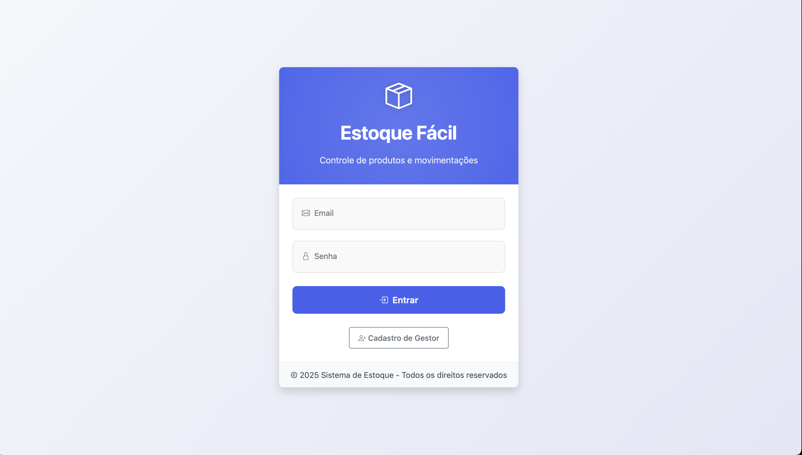
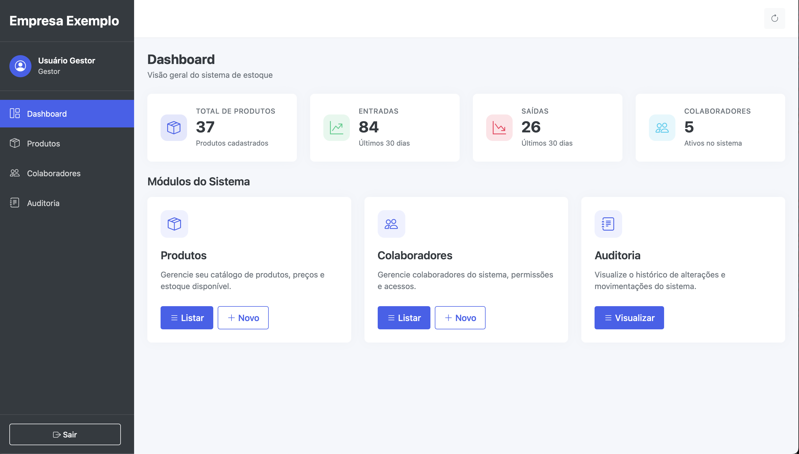
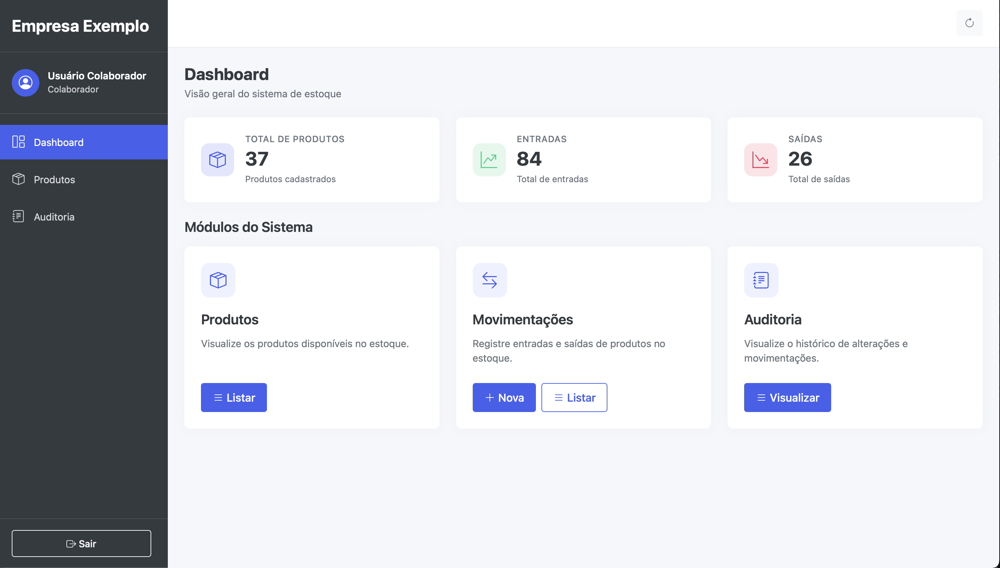
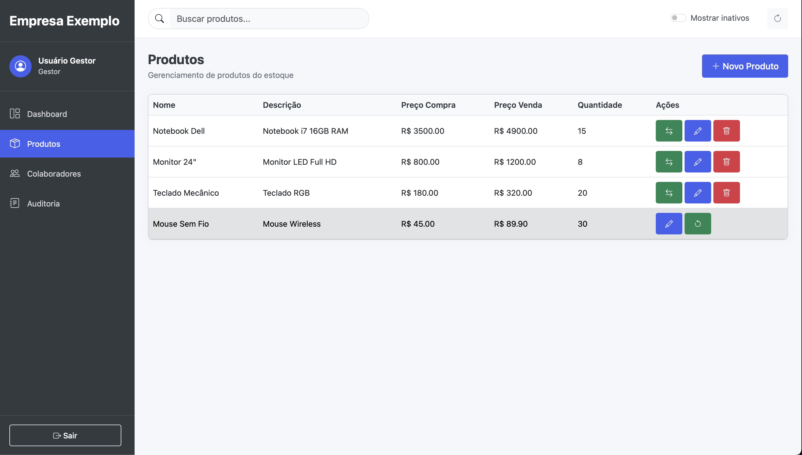
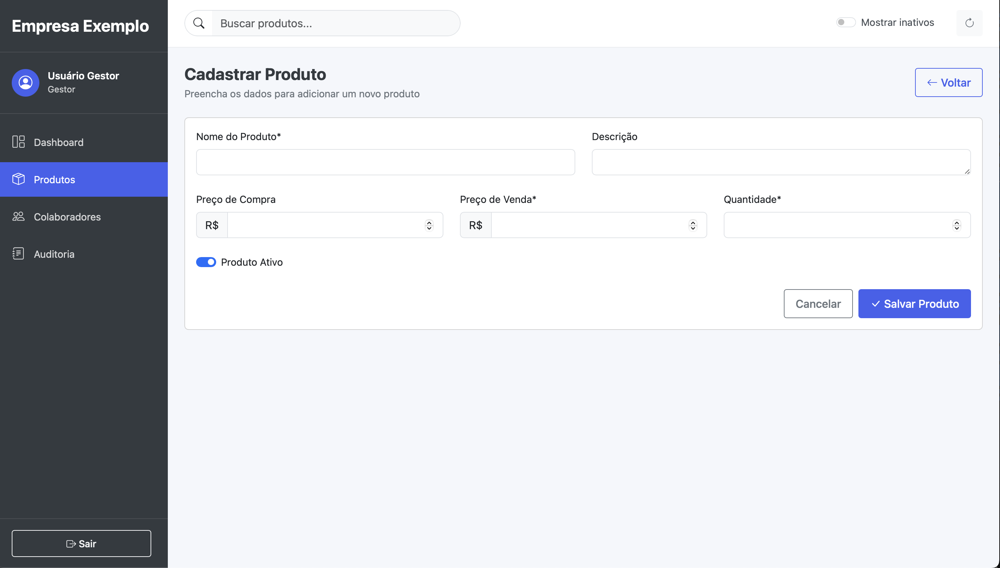
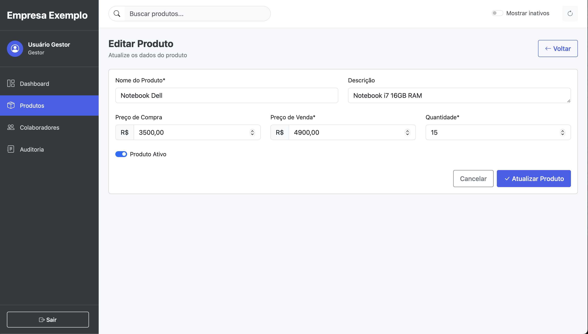
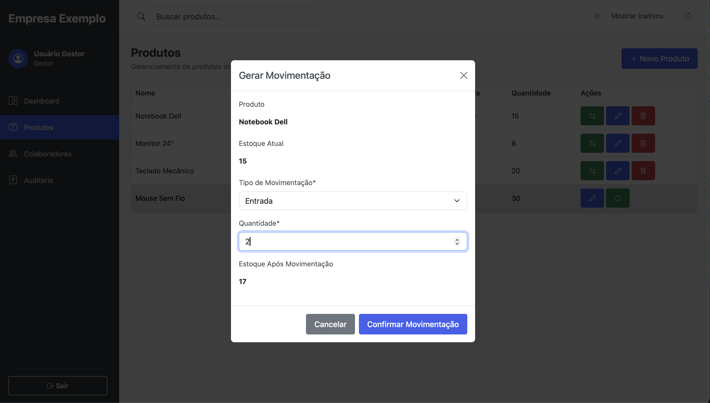
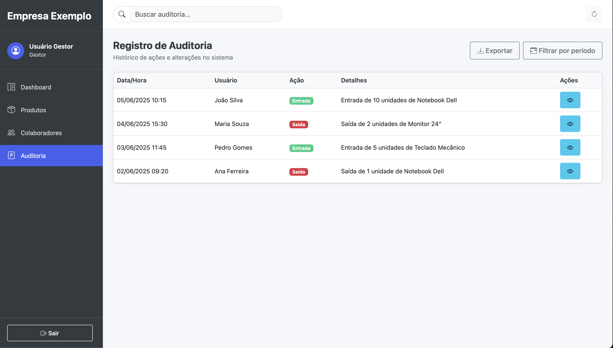
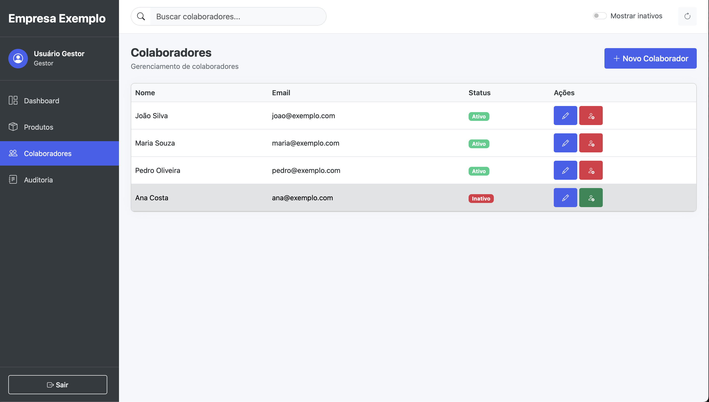

# Sistema Estoque Fácil

## 📋 Visão Geral

O Estoque Fácil é uma aplicação web desenvolvida para facilitar o gerenciamento de estoque e produtos em pequenas empresas. O sistema permite o controle completo de produtos, movimentações de entrada e saída, colaboradores e auditoria de todas as operações realizadas.

## ✨ Principais Funcionalidades

- **Dashboard intuitivo**: Visualização rápida de estatísticas e métricas do estoque
- **Gerenciamento de produtos**: Cadastro, edição, ativação/desativação de produtos
- **Controle de estoque**: Registro de entradas e saídas com validações
- **Gestão de colaboradores**: Gerenciamento de usuários e permissões
- **Auditoria completa**: Registro detalhado de todas as ações no sistema
- **Interface responsiva**: Adaptada para dispositivos móveis e desktop

## 👥 Perfis de Usuário e Permissionamento

O sistema possui dois perfis de usuário com diferentes níveis de acesso:

### Gestor
- Acesso completo ao sistema
- Cadastro e gerenciamento de colaboradores
- Cadastro, edição e controle de produtos
- Acesso a todas as estatísticas e relatórios
- Visualização do histórico completo de auditoria

### Colaborador
- Visualização de produtos
- Registro de movimentações (entradas e saídas)
- Acesso limitado ao dashboard
- Visualização de histórico de auditoria
- Sem acesso à gestão de colaboradores

### Deploy
- https://ganzellalorenzo.github.io/FrontEnd-estoqueFacil/

## 📸 Screenshots do Sistema

### Tela de Login

### Dashboard do Gestor

### Dashboard do Colaborador

### Listagem de Produtos

### Cadastro/Edição de Produtos

### Movimentação de Estoque

### Auditoria

### Gestão de Colaboradores

## 🚀 Tecnologias Utilizadas

- **Frontend**: HTML5, CSS3, JavaScript, Bootstrap 5
- **Interface**: Design responsivo com Bootstrap e ícones Bootstrap Icons
- **Usabilidade**: Formulários interativos, validações em tempo real e feedback visual

## 🛠️ Como Acessar o Sistema

1. **Login**:
   - Para acessar como gestor, use um email que contenha a palavra "gestor"
   - Para acessar como colaborador, use qualquer outro email
   - A senha pode ser qualquer valor (na demonstração)

2. **Navegação**:
   - Utilize o menu lateral para navegar entre as diferentes seções
   - O cabeçalho superior permite pesquisar e acessar ações rápidas
   - Botões de ação específicos estão disponíveis em cada módulo

## ⚠️ Aviso Importante

**Esta é uma demonstração do frontend apenas!** 

Esta versão é uma demonstração das interfaces do sistema, sem requisições reais a um backend. Os arquivos JavaScript foram simplificados para permitir a navegação entre telas e demonstrar a experiência do usuário, mas sem implementar a lógica de negócio completa ou persistência de dados.

Algumas características desta demonstração:
- Dados estáticos para simular o funcionamento
- Login simplificado baseado apenas no conteúdo do email
- Permissionamento visual entre perfis de gestor e colaborador
- Não há persistência de dados entre navegações

## 🔗 Projeto Completo

Para acessar o projeto completo com implementação do backend e todas as funcionalidades, visite:
[https://github.com/GanzellaLorenzo/InterdisciplinarFatec](https://github.com/GanzellaLorenzo/InterdisciplinarFatec)

O repositório completo contém:
- Backend em Java com Spring Boot
- Persistência de dados com Postgres
- Autenticação e autorização completas
- Implementação real de todas as funcionalidades
- Documentação detalhada da API

---

© 2025 Sistema Estoque Fácil - Desenvolvido como projeto interdisciplinar da FATEC
